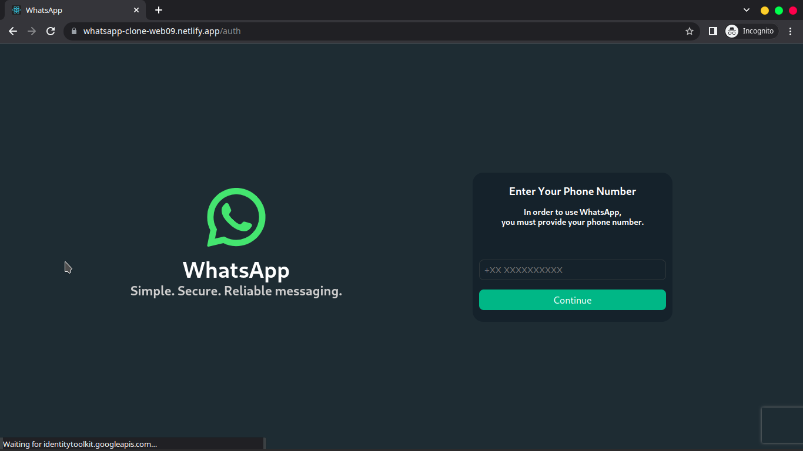
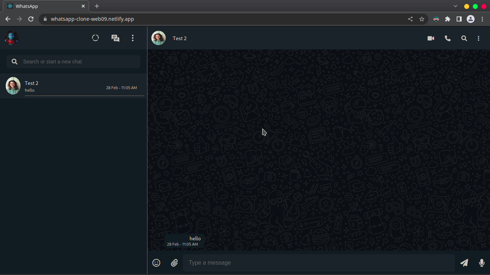

# Whatsapp Web Clone

<div style="text-align:center">

</div>
<div style="text-align:center">
 


</div>

[](https://app.netlify.com/sites/whatsapp-clone-web09/deploys)

## Built with 🛠

- [Typescript](https://www.typescriptlang.org/) - A strongly typed programming language that builds on JavaScript.
- [React](https://reactjs.org/) - A JavaScript library for building user interfaces.

## Features 👓

- [x] One To One Private Chat.
- [x] Group Chat.
- [x] View And Create Statuses.
- [x] Clean and Simple UI 🎨.
- [x] Dark mode 🌗

## Development Setup 🖥

Make sure you have Node.js installed.

### To run the project locally on your computer run:

```
npm install
npm start
```

Runs the app in the development mode.\
Open [http://localhost:3000](http://localhost:3000) to view it in your browser.

### To Build the project for deployment, run:

```
npm run build
```

Builds the app for production to the `build` folder.\
It correctly bundles React in production mode and optimizes the build for the best performance.

## Learn More

You can learn more in the [Create React App documentation](https://facebook.github.io/create-react-app/docs/getting-started).

To learn React, check out the [React documentation](https://reactjs.org/).

# Contributors

- [Vaibhav Goyal](https://github.com/vaibhavgoyal09)
